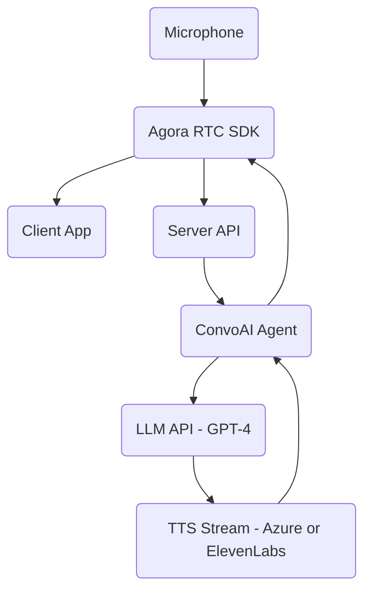

# 🎙️ Build a Live Voice Chatbot with Agora ConvoAI and GPT-4


## Intro ##

There’s something magical about gluing together real-time systems and watching the feedback loop play out in real time. That magic is what drew me to Agora’s **ConvoAI**—a framework that bridges speech, LLM reasoning, and TTS playback in a single pipeline.  

This wasn’t a formal build or a hackathon sprint. It started with a curiosity: _“Can I wire up my mic, speak naturally, and get a GPT-4-powered bot to talk back to me using Agora?”_  

The answer is yes—but it took a few iterations, some console spelunking, and help from a few LLM nudges along the way. This tutorial captures the journey: the wrong starts, the modular wins, and how I used LLM's as both a compass and a cleanup tool.

Furthermore, we’ll walk through how to use [Agora’s ConvoAI](https://www.agora.io/en/conversational-ai/) to build a live, voice-based chatbot powered by GPT-4. By combining Agora’s real-time audio SDK with their Conversational AI Engine, we can create a seamless interaction loop where a user speaks into a microphone, the speech is transcribed, processed by a large language model, and the response is spoken back in real time.

We’ll go from initial setup to streaming conversations, highlighting how LLMs can help throughout development—from designing architecture to cleaning up the final user interface.

## Prerequisites ##

Before starting, you should be familiar with:

- Basic JavaScript/TypeScript and React
- REST APIs and environment variables
- Using npm/yarn and setting up a Node.js project
- Access to the Agora Console and an Agora developer account

You’ll also need:
- An Agora project with RTC and ConvoAI enabled
- An OpenAI API Key (or another LLM provider supported by ConvoAI)

🔗 https://www.agora.io/en/blog/how-to-get-started-with-agora?utm_source=medium&utm_medium=blog&utm_campaign=Build_a_Live_Voice_Chatbot_with_Agora_ConvoAI_and_GPT-4

## Project Setup ##

We’ll use a Next.js app with API routes and client components to wire everything together.

```bash
npx create-next-app@latest agora-convoai-demo
cd agora-convoai-demo
npm install agora-rtc-sdk-ng dotenv
```

Create a `.env.local` file:

```env
NEXT_PUBLIC_AGORA_APP_ID=your_agora_app_id
AGORA_APP_CERTIFICATE=your_agora_cert
NEXT_PUBLIC_DEFAULT_CHANNEL=convoai-test
OPENAI_API_KEY=your_openai_key
```

--

## 🧠 Step 0: Throwing the Whole Problem at ChatGPT

I dropped this into ChatGPT:

> _“Build a full-stack app using Agora ConvoAI that lets a user speak into a mic and receive a spoken LLM-generated response.”_

What I got back was wrong—half-wired logic, missing token auth, and outdated imports—but **incredibly useful for understanding the architecture**.

It clarified that I’d need:

- A real-time voice connection via Agora RTC
- A backend for token generation and agent control
- An LLM (like OpenAI GPT-4)
- A way to stream TTS responses back into the audio channel

💡 **Lesson:** Wrong answers can still show you the right path.

---

## 🔧 Step 1: Manually Building the Core

Once I had the architecture in mind, I took a tutorial-style approach and built it step by step. Here’s how I wired things up.

---

### 🎙️ 1. Set Up Agora RTC (Voice Channel)

#### ✅ Prereqs:
- Create a project in [Agora Console](https://console.agora.io/)
- Enable RTC + ConvoAI services
- Grab your `App ID` and `App Certificate`
- Turn on **Token Authentication**

#### 🧪 React Client Setup

```tsx
// components/RtcClient.tsx
import { useEffect, useRef, useState } from "react";
import AgoraRTC from "agora-rtc-sdk-ng";

const APP_ID = process.env.NEXT_PUBLIC_AGORA_APP_ID!;
const CHANNEL = "demo";
const UID = Math.floor(Math.random() * 100000);

export default function RtcClient({ token }: { token: string }) {
  const [joined, setJoined] = useState(false);
  const clientRef = useRef(AgoraRTC.createClient({ mode: "rtc", codec: "vp8" }));

  useEffect(() => {
    if (!joined) return;
    const joinChannel = async () => {
      await clientRef.current.join(APP_ID, CHANNEL, token, UID);
      const audioTrack = await AgoraRTC.createMicrophoneAudioTrack();
      await clientRef.current.publish([audioTrack]);
    };
    joinChannel();
  }, [joined]);

  return (
    <div>
      <button onClick={() => setJoined(true)}>Join Voice</button>
    </div>
  );
}
```


---

### 🤖 2. Hook Up the ConvoAI Agent

Agora provides a REST API to connect an AI agent into the voice channel.

#### ✅ Enable ConvoAI in Console
- Go to **Project Settings → Extensions → ConvoAI**
- Generate a `Client ID` and `Client Secret`

#### 🧪 Backend `/api/agent/start`

```ts
// pages/api/agent/start.ts
export default async function handler(req, res) {
  const payload = {
    channel: "demo",
    user_id: "bot",
    llm: {
      provider: "openai",
      model: "gpt-4",
      api_key: process.env.OPENAI_API_KEY
    },
    voice: "en-US-JennyNeural"
  };

  const result = await fetch("https://api.agora.io/conversationalai/v1/project/YOUR_PROJECT_ID/agent/start", {
    method: "POST",
    headers: {
      Authorization: "Basic " + Buffer.from(`${process.env.CONVOAI_CLIENT_ID}:${process.env.CONVOAI_CLIENT_SECRET}`).toString("base64"),
      "Content-Type": "application/json"
    },
    body: JSON.stringify(payload)
  });

  const data = await result.json();
  res.status(200).json(data);
}
```


---

### 🔄 3. Test Voice → LLM → Voice Loop

🎉 It worked. I said:  
> _"Tell me a joke."_  
The bot responded:  
> _"Why don't skeletons fight each other? They don't have the guts."_

---

## 🪄 Step 2: Back to ChatGPT — for Cleanup & Styling

Once it worked, the UI was nonexistent. So I gave ChatGPT the working code and asked for Tailwind-styled layout.

📷 _Insert before/after screenshot of UI here_  
`/images/ui-before.png`  
`/images/ui-after.png`

💡 **Lesson:** Use the LLM to scaffold early and clean up late. It’s a great design assistant.

---

## 🧩 Final Architecture



---

## ✅ TL;DR Setup Summary

| Component           | What You Need                                        |
|---------------------|------------------------------------------------------|
| RTC Setup           | Agora App ID, Token Auth, `agora-rtc-sdk-ng`        |
| Token Server        | `/api/token` to generate RTC tokens securely        |
| Agent Backend       | `/api/agent/start`, `/api/agent/stop` endpoints     |
| LLM Config          | OpenAI API key and model setup                      |
| Frontend Hookup     | Mic permission, join/publish, call agent start API  |
| Styling             | Tailwind CSS via LLM-assisted layout polish         |

---

## 🔍 Insights

Throughout the process, a few key themes stood out that may help others looking to build something similar:

### 1. LLMs Make Great Rubber Duck Debaters
While ChatGPT didn’t give me perfect code, it gave me structure—fast. In just a few back-and-forths, I had the core building blocks of what I needed to wire up: RTC for voice, REST for the agent, and a feedback loop using TTS.

When you're dealing with multiple moving parts (RTC, REST APIs, LLM configuration), having an assistant that can hold the high-level architecture in memory while you focus on implementation is invaluable.

### 2. Modular Debugging Saved Me
Instead of trying to get everything working at once, I validated each step in isolation:
- RTC audio was joined and published
- REST calls for agent start/stop returned expected HTTP codes
- The agent was visible in the Agora Console
- Logs confirmed the bot responded to audio

This saved me hours chasing phantom bugs. Highly recommend the one-piece-at-a-time method.

### 3. Invisible Success Is Still Success
Since there was no UI initially, I had to trust logs, HTTP codes, and network activity. It’s easy to assume something’s broken when you don’t “see” it, but learning to recognize behind-the-scenes signals is part of becoming a better systems builder.

### 4. Go Back to the LLM Once It Works
The biggest value came **after** everything was wired up. Feeding the working, messy code back to ChatGPT and saying, “Make this readable and styled,” turned my proof-of-concept into something shareable and presentable in minutes.

### 5. Agora's ConvoAI Is Surprisingly Plug-and-Play
Once the token and LLM credentials were set, Agora’s API and agent just worked. The real-time performance was excellent, and the agent responded with only minor latency. The integration surface is small but powerful—and I’m already thinking of ways to extend this into captioning, intent routing, or multi-agent orchestration.

---


## Conclusion ##

We’ve successfully created a real-time voice chatbot using Agora ConvoAI and GPT-4. This framework offers flexibility for adding captioning, user interfaces, or multi-agent setups.

🔗 GitHub Repo: https://github.com/your-username/agora-convoai-demo

## Other Resources ##

- [Agora ConvoAI Documentation](https://docs.agora.io/en/conversational-ai/)
- [Agora RTC SDK](https://docs.agora.io/en/voice/)
- [Agora GitHub Examples](https://github.com/AgoraIO)
- I also invite you to join the Agora.io Developer Slack community: [Join Here](https://www.agora.io/en/join-slack/

