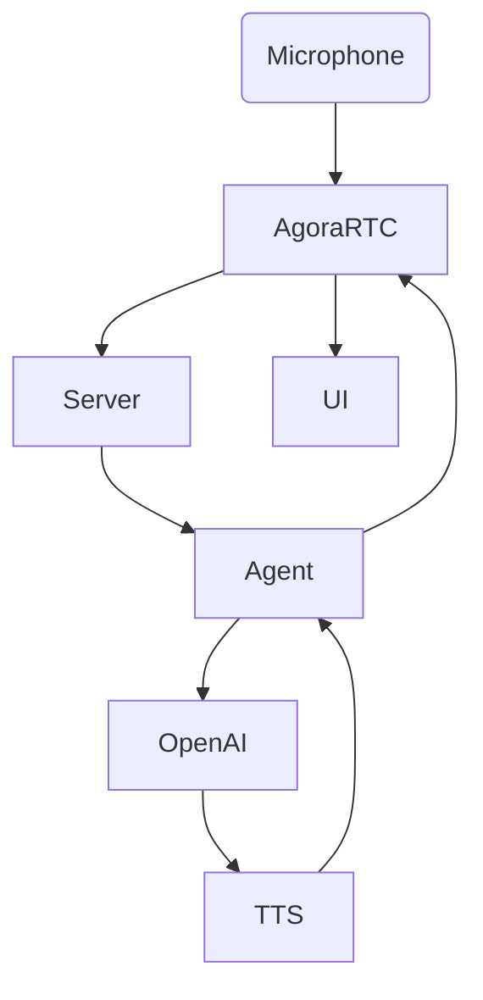

# Create a Voice AI Agent using Prompt Engineering and Agora


Curious how to bring real-time voice and conversational AI together? 


I approached it by trying to one-shot it in ChatGPT, have it not work, but generate a nice scaffolding for reference.

From the generated reference I was easily able to reference the portions of the Agora stack that I needed to understand. I then proceeded to fix and/or correctly implement each of the relevant Agora components, and finally combine the results into a nicely working demo covering my use case.


## 2. Prerequisites

To successfully implement video calling with Agora, you must have the following:

- **[Get Started with Agora ](https://docs.agora.io/en/Agora%20Platform/get_appid_token?platform=All%20Platforms)** 
- **Accounts:** Agora, OpenAI.
- **Tech:** Node.js, npm, Git, Vercel (optional).
- **Skills:** Familiarity with React/Next.js.


## 3. Setup & Configuration

### Clone Template

```

git clone https://github.com/AgoraIO-Community/convoai-from-scratch
cd convoai-from-scratch

```

### Environment Variables

Copy as below, then edit `.env.local`:

```

NEXT_PUBLIC_AGORA_APP_ID=your_app_id
AGORA_APP_CERTIFICATE=your_cert
AGORA_RTC_TOKEN_TTL=3600

AGORA_CUSTOMER_ID=your_customer_id
AGORA_CUSTOMER_SECRET=your_customer_secret

OPENAI_API_KEY=your_openai_key
OPENAI_LLM_MODEL=gpt-4o-mini
OPENAI_TTS_MODEL=gpt-4o-mini-tts
OPENAI_TTS_VOICE=alloy

NEXT_PUBLIC_DEFAULT_CHANNEL=scratch-room
WEBHOOK_SHARED_SECRET=optional

```

**Best Practice:** Never expose secret keys to the client—prefix only non-sensitive envs with `NEXT_PUBLIC_`!


### Install & Run

```

npm install
npm run dev

# Open http://localhost:3000

```


## 4. System Architecture

### Components

- **Agora RTC** for real-time audio streaming.
- **ConvoAI Engine** to launch/manage agents.
- **OpenAI GPT-4** for chat reasoning and TTS.
- **Next.js** for frontend and serverless backend.

### Diagram





## 5. Step-by-Step Implementation

### Step 0: Ideation with ChatGPT

Use LLMs to scaffold project architecture—expect guidance, not full implementation.

Initial code will be incomplete but will clarify system integration points.

Follow the steps to verify each of the Agora components.

### Step 1: RTC Voice Channel

1. **Create project** in Agora Console.
2. **Enable RTC** and ConvoAI extensions.
3. **Configure for token auth.**

**Sample RTC Client:**
```

import { useEffect, useRef, useState } from "react";
import AgoraRTC from "agora-rtc-react";

const APP_ID = process.env.NEXT_PUBLIC_AGORA_APP_ID!;
const CHANNEL = "demo";
const UID = Math.floor(Math.random() * 100000);

export default function RtcClient({ token }: { token: string }) {
const [joined, setJoined] = useState(false);
const clientRef = useRef(AgoraRTC.createClient({ mode: "rtc", codec: "vp8" }));

useEffect(() => {
    if (!joined) return;
    const joinChannel = async () => {
        await clientRef.current.join(APP_ID, CHANNEL, token, UID);
        const audioTrack = await AgoraRTC.createMicrophoneAudioTrack();
        await clientRef.current.publish([audioTrack]);
    };
    joinChannel();
    return () => {
    clientRef.current.leave();
};
}, [joined]);

return (
    <div>
    <button onClick={() => setJoined(true)}>Join Voice</button>
    </div>
    );
}

```
Tips:
- Make channel name and UID flexible.
- Always clean up tracks/clients.

### Step 2: ConvoAI Agent Orchestration

Before writing any code, enable the ConvoAI extension in your Agora Dashboard
.
From the Extensions tab, activate Conversational AI, then generate your Customer ID and Customer Secret — you’ll need these values for authenticated API calls.

Next, create the backend routes that manage your agent lifecycle. These are server-only endpoints that connect your app to Agora’s Conversational AI APIs.

File structure:

```
app/
  api/
    agent/
      start/route.ts
      text/route.ts
      stop/route.ts
```

Example payload structure:

```{
  "channel": "demo",
  "user_id": "bot",
  "llm": { "provider": "openai", "model": "gpt-4o-mini" },
  "tts": { "model": "gpt-4o-mini-tts", "voice": "alloy" }
}
```

Start Agent Endpoint (app/api/agent/start/route.ts):

```export async function POST() {
  const payload = {
    channel: process.env.NEXT_PUBLIC_DEFAULT_CHANNEL || "demo",
    user_id: "bot",
    llm: { provider: "openai", model: process.env.OPENAI_LLM_MODEL || "gpt-4o-mini" },
    tts: { model: process.env.OPENAI_TTS_MODEL || "gpt-4o-mini-tts", voice: process.env.OPENAI_TTS_VOICE || "alloy" }
  };

  const r = await fetch(
    `https://api.agora.io/conversational-ai-agent/v2/projects/${process.env.NEXT_PUBLIC_AGORA_APP_ID}/agents:join`,
    {
      method: "POST",
      headers: {
        "Content-Type": "application/json",
        Authorization:
          "Basic " + Buffer.from(`${process.env.AGORA_CUSTOMER_ID}:${process.env.AGORA_CUSTOMER_SECRET}`).toString("base64")
      },
      body: JSON.stringify(payload)
    }
  );

  if (!r.ok) return new Response(await r.text(), { status: r.status });
  return new Response(await r.text(), { status: 200 });
}
```

Quick Test:

```aiignore
curl -X POST http://localhost:3000/api/agent/start
```

You should receive a 200 OK response confirming the agent joined your channel.

Once confirmed, integrate this route into your front-end RTC flow — when a user joins, the agent joins too.


Without enabling the ConvoAI extension and generating your credentials first, your API calls will fail authentication and the agent will never appear in the Agora dashboard or your RTC session.

Would you like me to add a one-line dashboard verification step (“Check that your agent appears under Usage > Active Sessions”) right after the test command? It’s often a helpful visual confirmation.

**Sample Agent Endpoint:**
```
export default async function handler(req, res) {
const payload = {
channel: "demo",
user_id: "bot",
llm: {
    provider: "openai",
    model: "gpt-4",
    api_key: process.env.OPENAI_API_KEY
    },
    voice: "en-US-JennyNeural"
    };

    const result = await fetch("https://api.agora.io/conversationalai/v1/project/YOUR_PROJECT_ID/agent/start", {
    method: "POST",
    headers: {
        Authorization: "Basic " + Buffer.from(`${process.env.CONVOAI_CLIENT_ID}:${process.env.CONVOAI_CLIENT_SECRET}`).toString("base64"),
    "Content-Type": "application/json"
    },
    body: JSON.stringify(payload)
});

if (!result.ok) {
    res.status(result.status).json({ error: "Agent failed to start" });
return;
}

const data = await result.json();
    res.status(200).json(data);
}

```
- Validate agent joins in dashboard usage section. https://console.agora.io/usage

### Step 3: Live Voice→LLM→Voice Exchange

At this stage, you have your Agora RTC client working and an agent endpoint ready to launch. Now it’s time to connect them — sending your voice to the agent, routing the text through the LLM, converting the result to speech, and streaming it back in real time.

Capture live microphone audio and publish it to the Agora channel.

Trigger your backend agent endpoint to process speech through GPT-4 + OpenAI TTS.

Play the agent’s audio responses back to the user in real time.

Display captions and provide simple mic/agent controls in the UI.

#### Understand the Workflow

The “Voice → LLM → Voice” loop:

- User joins the Agora RTC channel and begins streaming microphone audio.
- Server-side agent (via your /api/agent route) receives events and invokes GPT-4 for reasoning.
- OpenAI TTS converts the agent’s text reply to audio.
- Agora RTC transmits the agent’s synthesized voice back into the same channel.
- Front-end UI displays text captions and manages mic or mute actions.


#### Implement Voice Exchange Logic

To connect live audio and agent replies, extend your front-end RTC client with event handling and a backend call.

Front-end Example:

```
import { useEffect, useRef, useState } from "react";
import AgoraRTC from "agora-rtc-react";

const APP_ID = process.env.NEXT_PUBLIC_AGORA_APP_ID!;
const CHANNEL = "demo";
const UID = Math.floor(Math.random() * 100000);

export default function VoiceAgent({ token }: { token: string }) {
const [joined, setJoined] = useState(false);
const [agentReply, setAgentReply] = useState("");
const clientRef = useRef(AgoraRTC.createClient({ mode: "rtc", codec: "vp8" }));

useEffect(() => {
if (!joined) return;

    const startSession = async () => {
      // Join channel
      await clientRef.current.join(APP_ID, CHANNEL, token, UID);

      // Create and publish audio track
      const micTrack = await AgoraRTC.createMicrophoneAudioTrack();
      await clientRef.current.publish([micTrack]);

      // Call backend to start the agent
      const res = await fetch("/api/agent", { method: "POST" });
      const data = await res.json();
      setAgentReply(data.reply || "Agent connected.");
    };

    startSession();
    return () => clientRef.current.leave();
}, [joined]);

return (
    <div>
    <button onClick={() => setJoined(true)}>Start Voice Agent</button>
    <p>{agentReply}</p>
    </div>
    );
}

```
Backend Example (/api/agent):

```
export default async function handler(req, res) {
const response = await fetch("https://api.agora.io/conversationalai/v1/project/YOUR_PROJECT_ID/agent/start", {
method: "POST",
headers: {
    Authorization: "Basic " + Buffer.from(`${process.env.CONVOAI_CLIENT_ID}:${process.env.CONVOAI_CLIENT_SECRET}`).toString("base64"),
    "Content-Type": "application/json"
},
body: JSON.stringify({
channel: "demo",
user_id: "bot",
llm: {
    provider: "openai",
    model: "gpt-4o-mini"
},
tts: {
    model: "gpt-4o-mini-tts",
    voice: "alloy"
    }
})
});

if (!response.ok) {
    res.status(response.status).json({ error: "Agent failed to start" });
    return;
}

const data = await response.json();
res.status(200).json({ reply: data.message || "Agent ready." });
}

```
Follow these steps to confirm everything works end-to-end:

1. Join the Voice Channel — Run your app and click “Start Voice Agent.” Confirm the browser requests microphone access.

2. Speak a phrase — Say “Hello” or “How are you?”

3. Watch the logs — You should see joined channel, published audio track, and Agent connected messages in the console.

4. Hear a response — Within a few seconds, the agent should reply via GPT-4 + TTS, audible in the same channel.

5. View text captions (optional) — If implemented, confirm that text responses also render under the button.

6. Stop or restart — Reload the page and ensure the agent rejoins cleanly without errors.

### Step 4: Styling & UI Enhancement
Once your prototype is functionally solid, styling becomes quick and painless. You’re now working from known-working components, so all changes are purely visual — low risk, high payoff.

At this stage, you can hand your existing code to an LLM and ask it to apply Tailwind or your preferred styling framework. Because the structure and logic are already validated, the model can safely generate clean, responsive UI updates without breaking functionality.

Tailwind is ideal for this workflow: class-based, predictable, and easy to tweak. In minutes, you can transform a raw demo into a polished, production-ready interface that looks great across devices — no tedious CSS debugging required.

### Step 5. Testing

To confirm your demo is solid:

- Start local dev server → open app in a fresh browser window (not localhost tab you’ve been using).

- Join voice channel → confirm mic LED or permission indicator lights up.

- Speak a short phrase → check Agora dashboard to see active stream under your UID.

- Start the Agent

- Watch for agent response → verify both text and voice appear within a few seconds.

- Open console logs → confirm no 4xx/5xx responses from Agora or OpenAI.

- End session → verify cleanup logs (leave, track.close) execute without warnings.

- Reload page → rejoin; ensure token refresh and channel re-connect work seamlessly.

If all steps succeed, your ConvoAI demo is ready to show!

### Step 7. Deployment ( Optional )

**Vercel:**
```
vercel --prod
```
- Set env vars in the Vercel dashboard (backend only for secrets).
- Check console and serverless logs for issues.
  
## 8. Now It's Your Turn!

After an initial naive prompt, review your results, gain clarity as to important moving parts. Early LLM-driven prototyping guides system design, even if the output isn’t production-ready. Make sure the overall structure isn't too wonky or distracting. Do your normal code, debug, and iteration routine on the components—they probably won't work initially—but with sane structure and boilerplate to keep you focused, it’s painless and results in a working prototype while still gaining proper understanding.

Modular, stepwise validation saves countless hours chasing complex bugs. Real-world signal (logs, HTTP codes, dashboard events) is as important as visible UI feedback.

Then you re-prompt with new information, individually tested components, and in all likelihood it should be close to the final product functionality-wise. I also added some LLM-driven styling at this stage, which while not technically necessary for this exercise, a decent UI is always appreciated—and LLMs are way better at CSS than is safe for your average human.

When you’re ready to explore deeper, source code is in [GitHub](https://github.com/AgoraIO-Community/convoai-from-scratch), and check out the [Agora Docs](https://docs.agora.io/en/)
for detailed API references and integration examples, or head over to our [blog](https://www.agora.io/en/category/developer/).
to see what others are building and get started with your own real-time prototype.
