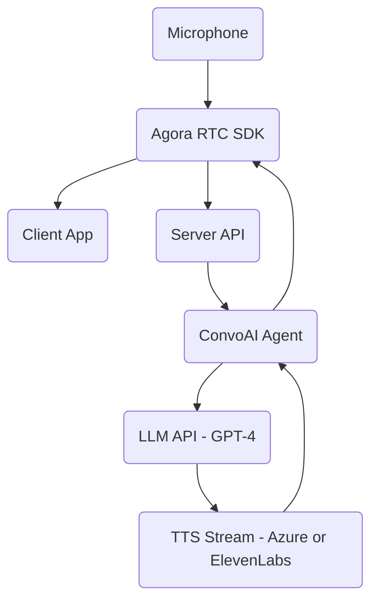

# ConvoAI from Scratch -  Build a Live Voice Chatbot with Agora ConvoAI + GPT-4

## Overview
This guide walks you through building a real-time **voice-enabled chatbot** using:

- **Agora RTC SDK** (for mic/audio streaming)
- **Agora ConvoAI Engine** (for agent control)
- **OpenAI APIs** (for LLM + TTS)
- **Next.js** (frontend + backend API routes)

You’ll be able to:
- Join a real-time audio channel
- Launch an AI agent that listens, thinks, and speaks
- Type or talk to the agent and hear its LLM-generated responses
- View captions and integrate webhooks or polling

---

## 📀 Project Setup

### 1. Clone the Repo
```bash
git clone https://github.com/AgoraIO-Community/convoai-from-scratch
cd convoai-from-scratch
```

### 2. Setup Environment Variables
```bash
cp .env.local.example .env.local
```
Then edit `.env.local` and set:

```env
# Agora
NEXT_PUBLIC_AGORA_APP_ID=your_app_id
AGORA_APP_CERTIFICATE=your_cert
AGORA_RTC_TOKEN_TTL=3600

# ConvoAI
AGORA_CUSTOMER_ID=your_customer_id
AGORA_CUSTOMER_SECRET=your_customer_secret

# OpenAI
OPENAI_API_KEY=your_openai_key
OPENAI_LLM_MODEL=gpt-4o-mini
OPENAI_TTS_MODEL=gpt-4o-mini-tts
OPENAI_TTS_VOICE=alloy

# Optional
NEXT_PUBLIC_DEFAULT_CHANNEL=devrel-demo
WEBHOOK_SHARED_SECRET=optional
```

### 3. Install and Run
```bash
npm install
npm run dev
# Then open http://localhost:3000
```

---

## 🧠 Step 0: Throwing the Whole Problem at ChatGPT
I dropped this into ChatGPT:
> _"Build a full-stack app using Agora ConvoAI that lets a user speak into a mic and receive a spoken LLM-generated response."_

What I got back was wrong—half-wired logic, missing token auth, and outdated imports—but **incredibly useful for understanding the architecture**.

It clarified that I’d need:
- A real-time voice connection via Agora RTC
- A backend for token generation and agent control
- An LLM (like OpenAI GPT-4)
- A way to stream TTS responses back into the audio channel

💡 **Lesson:** Wrong answers can still show you the right path.

---

## 🔧 Step 1: Manually Building the Core
Once I had the architecture in mind, I took a tutorial-style approach and built it step by step.

### 🎧 1. Set Up Agora RTC (Voice Channel)

#### ✅ Prereqs:
- Create a project in [Agora Console](https://console.agora.io/)
- Enable RTC + ConvoAI services
- Grab your `App ID` and `App Certificate`
- Turn on **Token Authentication**

#### 🧪 React Client Setup
```tsx
// components/RtcClient.tsx
import { useEffect, useRef, useState } from "react";
import AgoraRTC from "agora-rtc-sdk-ng";

const APP_ID = process.env.NEXT_PUBLIC_AGORA_APP_ID!;
const CHANNEL = "demo";
const UID = Math.floor(Math.random() * 100000);

export default function RtcClient({ token }: { token: string }) {
  const [joined, setJoined] = useState(false);
  const clientRef = useRef(AgoraRTC.createClient({ mode: "rtc", codec: "vp8" }));

  useEffect(() => {
    if (!joined) return;
    const joinChannel = async () => {
      await clientRef.current.join(APP_ID, CHANNEL, token, UID);
      const audioTrack = await AgoraRTC.createMicrophoneAudioTrack();
      await clientRef.current.publish([audioTrack]);
    };
    joinChannel();
  }, [joined]);

  return (
    <div>
      <button onClick={() => setJoined(true)}>Join Voice</button>
    </div>
  );
}
```

📷 _Add a screenshot of console showing published audio track here_  
`/images/agora-audio-track-console.png`

---

### 🤖 2. Hook Up the ConvoAI Agent

Agora provides a REST API to connect an AI agent into the voice channel.

#### ✅ Enable ConvoAI in Console
- Go to **Project Settings → Extensions → ConvoAI**
- Generate a `Client ID` and `Client Secret`

#### 🧪 Backend `/api/agent/start`
```ts
// pages/api/agent/start.ts
export default async function handler(req, res) {
  const payload = {
    channel: "demo",
    user_id: "bot",
    llm: {
      provider: "openai",
      model: "gpt-4",
      api_key: process.env.OPENAI_API_KEY
    },
    voice: "en-US-JennyNeural"
  };

  const result = await fetch("https://api.agora.io/conversationalai/v1/project/YOUR_PROJECT_ID/agent/start", {
    method: "POST",
    headers: {
      Authorization: "Basic " + Buffer.from(`${process.env.CONVOAI_CLIENT_ID}:${process.env.CONVOAI_CLIENT_SECRET}`).toString("base64"),
      "Content-Type": "application/json"
    },
    body: JSON.stringify(payload)
  });

  const data = await result.json();
  res.status(200).json(data);
}
```

📷 _Insert a screenshot showing the bot joining the channel_  
`/images/bot-agent-joined.png`

---

### 🔄 3. Test Voice → LLM → Voice Loop
🎉 It worked. I said:  
> _"Tell me a joke."_  
The bot responded:  
> _"Why don't skeletons fight each other? They don't have the guts."_

---

## 🪄 Step 2: Back to ChatGPT — for Cleanup & Styling
Once it worked, the UI was nonexistent. So I gave ChatGPT the working code and asked for Tailwind-styled layout.

📷 _Insert before/after screenshot of UI here_  
`/images/ui-before.png`  
`/images/ui-after.png`

💡 **Lesson:** Use the LLM to scaffold early and clean up late. It’s a great design assistant.

---

## 🧩 Final Architecture


---

## 🚦 Usage Flow

1. **Join** — token minted via `/api/token`; client publishes mic.
2. **Start Agent** — server calls Agora **/join** with LLM+TTS config; stores `agent_id`.
3. **Type in Chat** — client sends your text to **`/api/agent/text`**:
   - Server calls **OpenAI Chat** to get `aiText`.
   - If **TTS enabled**, server calls **/speak** to voice `aiText` from the agent.
   - Chat UI shows your text + `aiText`.
4. **Stop Agent** — demo route is a no-op (adjust to your plan’s leave endpoint if needed).

---

## 📡 API Reference

- `POST /api/token` — Mint RTC token (server-only).
- `POST /api/agent/start` — Join agent to channel using **v2 join** (includes `llm` + `tts`).
- `POST /api/agent/text` — Text → OpenAI → (optional) agent **/speak**.
- `POST /api/agent/stop` — Placeholder; wire to your leave endpoint if required.
- `POST /api/tts/speak` — Direct OpenAI TTS to base64 MP3 (used only for client-side testing).
- `GET /api/agent/history` — Poll agent replies as captions if webhooks are not wired.

---

## ☁️ Deploy to Vercel

```bash
vercel --prod
```

- Framework: **Next.js**
- Add **env vars** in Vercel → Project → Settings → Environment Variables
- Build command: `next build` (default)

---
