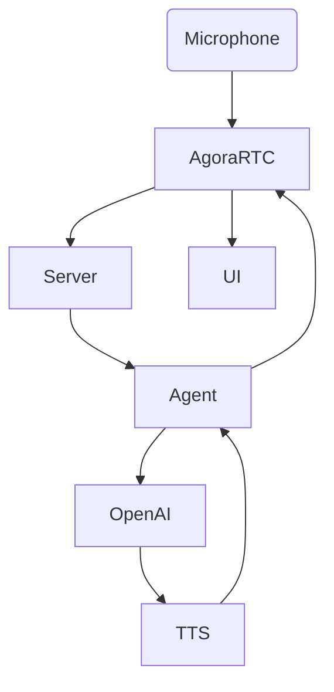

# ConvoAI from Scratch — Build a Live Voice Chatbot with Agora ConvoAI 

## 1. Introduction & Motivation

Curious how to bring real-time voice and conversational AI together? 

This guide walks you through the steps — highlighting approaches and lessons learned, architectural design, debugging, and best practices along the way.

I approached it by trying to one-shot it in ChatGPT, have it not work, but generate a nice scaffolding for reference.

From the generated reference I was easily able to reference the portions of the Agora stack that I needed to understand. I then proceeded to fix and/or correctly implement each of the relevant Agora components, and finally combine the results into a nicely working demo covering my use case.


---

## 2. Prerequisites

To successfully implement video calling with Agora, you must have the following:

- **Accounts:** Agora, OpenAI.
- **Tech:** Node.js, npm, Git, Vercel (optional).
- **Skills:** Familiarity with React/Next.js.


---

## 3. Setup & Configuration

### Clone Template

```

git clone https://github.com/AgoraIO-Community/convoai-from-scratch
cd convoai-from-scratch

```

### Environment Variables

Copy as below, then edit `.env.local`:

```

NEXT_PUBLIC_AGORA_APP_ID=your_app_id
AGORA_APP_CERTIFICATE=your_cert
AGORA_RTC_TOKEN_TTL=3600

AGORA_CUSTOMER_ID=your_customer_id
AGORA_CUSTOMER_SECRET=your_customer_secret

OPENAI_API_KEY=your_openai_key
OPENAI_LLM_MODEL=gpt-4o-mini
OPENAI_TTS_MODEL=gpt-4o-mini-tts
OPENAI_TTS_VOICE=alloy

NEXT_PUBLIC_DEFAULT_CHANNEL=scratch-room
WEBHOOK_SHARED_SECRET=optional

```

**Best Practice:** Never expose secret keys to the client—prefix only non-sensitive envs with `NEXT_PUBLIC_`!

---

### Install & Run

```

npm install
npm run dev

# Open http://localhost:3000

```

---

## 4. System Architecture

### Components

- **Agora RTC** for real-time audio streaming.
- **ConvoAI Engine** to launch/manage agents.
- **OpenAI GPT-4** for chat reasoning and TTS.
- **Next.js** for frontend and serverless backend.

### Diagram




---

## 5. Step-by-Step Implementation

### Step 0: Ideation with ChatGPT

Use LLMs to scaffold project architecture—expect guidance, not full implementation.

Initial code will be incomplete but will clarify system integration points.

Follow the steps to verify each of the Agora components.

### Build Step 1: RTC Voice Channel

1. **Create project** in Agora Console.
2. **Enable RTC** and ConvoAI extensions.
3. **Configure for token auth.**

**Sample RTC Client:**
```

import { useEffect, useRef, useState } from "react";
import AgoraRTC from "agora-rtc-sdk-ng";

const APP_ID = process.env.NEXT_PUBLIC_AGORA_APP_ID!;
const CHANNEL = "demo";
const UID = Math.floor(Math.random() * 100000);

export default function RtcClient({ token }: { token: string }) {
const [joined, setJoined] = useState(false);
const clientRef = useRef(AgoraRTC.createClient({ mode: "rtc", codec: "vp8" }));

useEffect(() => {
    if (!joined) return;
    const joinChannel = async () => {
        await clientRef.current.join(APP_ID, CHANNEL, token, UID);
        const audioTrack = await AgoraRTC.createMicrophoneAudioTrack();
        await clientRef.current.publish([audioTrack]);
    };
    joinChannel();
    return () => {
    clientRef.current.leave();
};
}, [joined]);

return (
<div>
<button onClick={() => setJoined(true)}>Join Voice</button>
</div>
);
}

```
Tips:
- Make channel name and UID flexible.
- Always clean up tracks/clients.

### Build  Step 2: ConvoAI Agent Orchestration

- Enable ConvoAI extension in [Agora dashboard](https://console.agora.io/), generate credentials.
- Connect agent using backend API route. 

**Sample Agent Endpoint:**
```

export default async function handler(req, res) {
const payload = {
channel: "demo",
user_id: "bot",
llm: {
    provider: "openai",
    model: "gpt-4",
    api_key: process.env.OPENAI_API_KEY
    },
    voice: "en-US-JennyNeural"
    };

    const result = await fetch("https://api.agora.io/conversationalai/v1/project/YOUR_PROJECT_ID/agent/start", {
    method: "POST",
    headers: {
        Authorization: "Basic " + Buffer.from(`${process.env.CONVOAI_CLIENT_ID}:${process.env.CONVOAI_CLIENT_SECRET}`).toString("base64"),
    "Content-Type": "application/json"
    },
    body: JSON.stringify(payload)
});

if (!result.ok) {
    res.status(result.status).json({ error: "Agent failed to start" });
return;
}

const data = await result.json();
    res.status(200).json(data);
}

```
- Validate agent joins in dashboard/console logs. https://console.agora.io/

### Build Step 3: Live Voice→LLM→Voice Exchange

- User joins, speaks; agent responds via GPT-4 logic + OpenAI TTS.
- UI can show text/captions and control mic/agent actions.

### Build Step 4: Styling & UI Enhancement

Prototype with simple UI, then request LLM (ChatGPT) or Tailwind for design improvements. Aim for accessibility and cross-device compatibility.

---

## 6. API Reference

| Endpoint         | Description                       |
|------------------|-----------------------------------|
| /api/token       | Issues RTC tokens (server only)   |
| /api/agent/start | Starts agent with LLM+TTS config  |
| /api/agent/text  | Sends message to agent            |
| /api/agent/stop  | Disconnects agent                 |
| /api/agent/history | Polls channel transcript        |

---

## 7. Deployment

**Vercel:**
```

vercel --prod

```
- Set env vars in the Vercel dashboard (backend only for secrets).
- Check console and serverless logs for issues.

---

## 8. Troubleshooting & Best Practices

- Modular debugging: Test RTC join, agent start, LLM/TTS endpoints independently.
- Confirm microphone, permissions, and browser compatibility.
- Inspect agent logs for join/reply status.
- Handle and display errors gracefully.
- Only expose public variables to client—keep secret keys server-side.

---

## 9. Conclusion

- Early LLM-driven prototyping guides system design, even if output isn’t production-ready.
- Modular, stepwise validation saves countless hours chasing complex bugs.
- Real-world signal (logs, HTTP codes, dashboard events) is as important as visible UI feedback.

---

